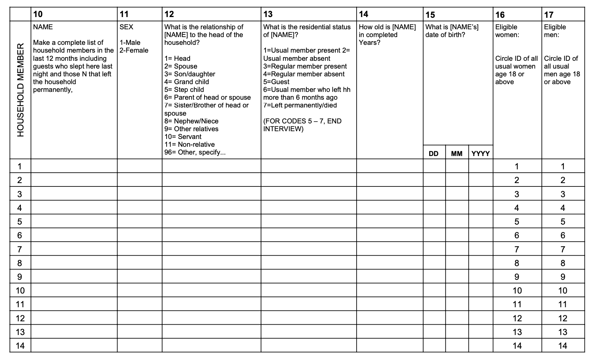
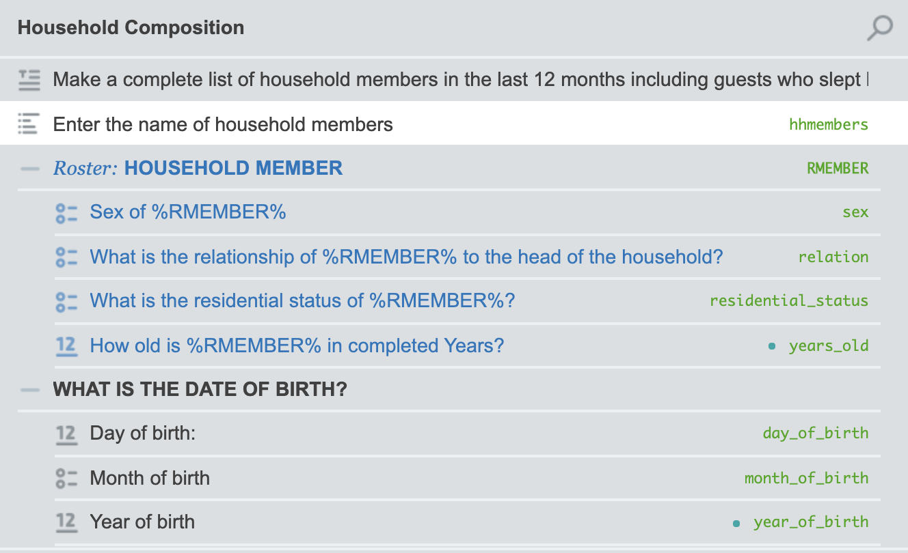
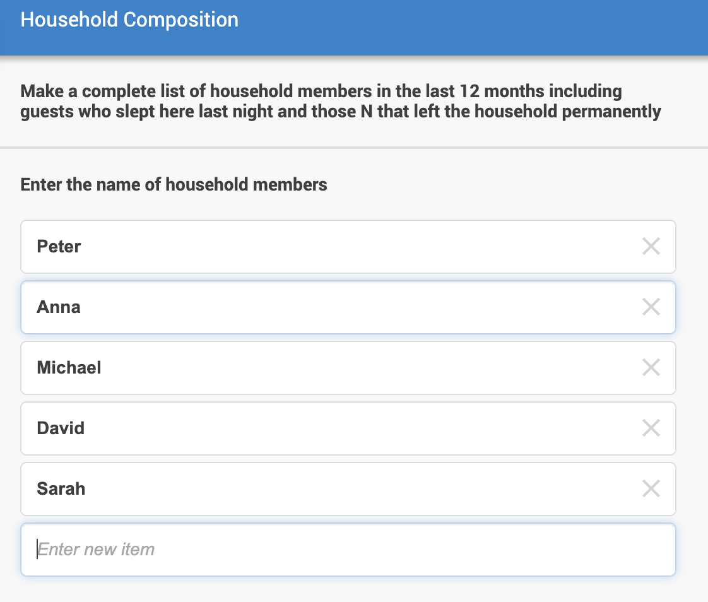
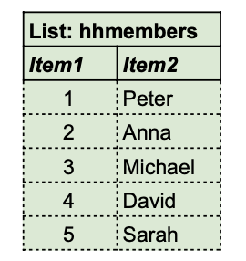
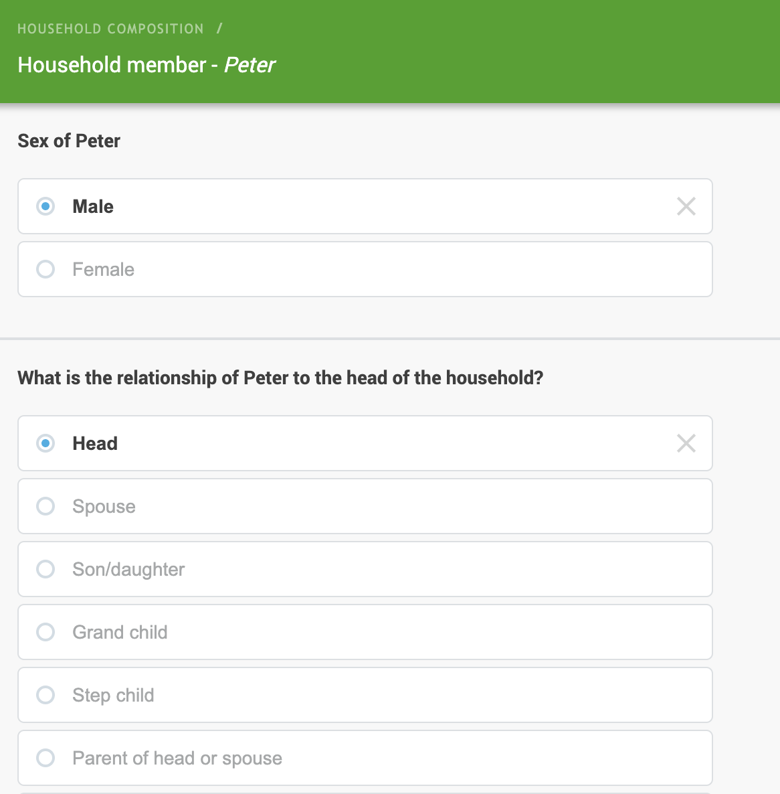
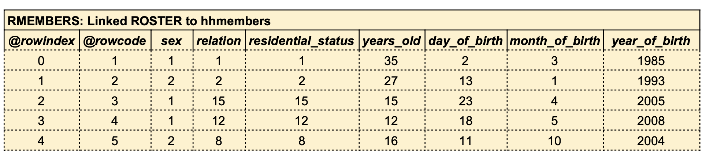

# Household ROSTER

## Paper questionnaire roster
This example is intended to show how a tyoical questionnaire roster is designed in [Survey Solutions](https://mysurvey.solutions/). In this examples the roster captures and validates information for each houshold member.

Below is the layout of a roster on a paper questionnaire  used to capture the main data on household members.

 
## Questionnaire designed in Survey Solution
The image presents how this roster is designed in SuSo.

[If you have access to the SuSo Designer, you can go to the previous questionnaire here](https://webtester.mysurvey.solutions/WebTester/Interview/ca6d1e51427945738f2189e69c25b65d/Section/7fa7e4e509e9cf60f8139c9879a456cc_1)

## Questionnaire exceution and memory objects 

In our design **hhmembers** object is List type field and **RMEMBERS** roster type linked to hhmembers list. 

When executing the questionnaire in SuSo, as the user enters the names of the household members, the **hhmembers** memory object obtains these values. Note that the hhmembers object has two columns, the **Item1** column stores the identifying number of each member and the **item2** column stores the text entered by the user.

Capture of household members (hhmembers list)

Capture of the main data of each member (RMEMBERS roster)

