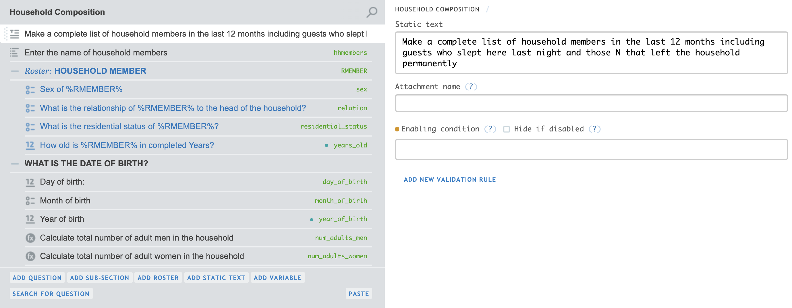
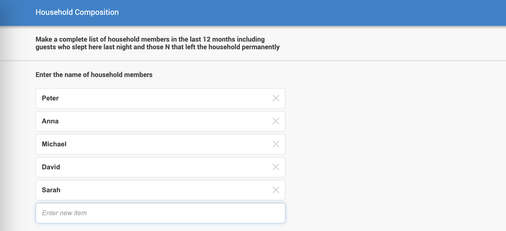
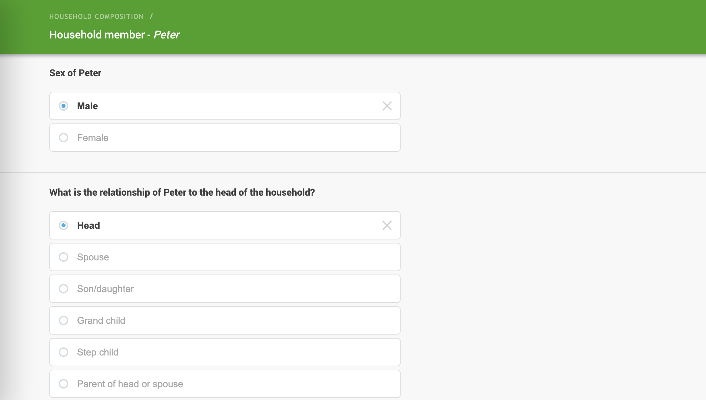
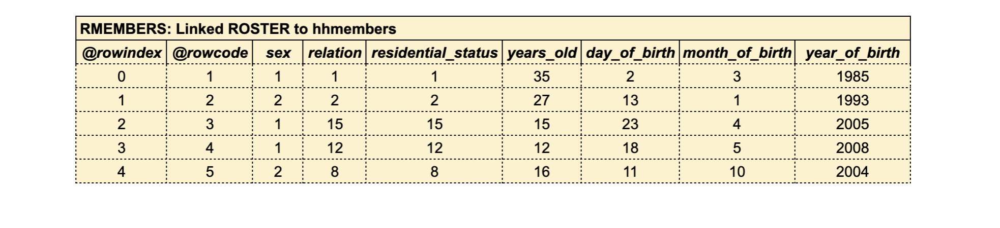

# Household ROSTER

## Paper questionnaire roster
This example is intended to show how a tyoical questionnaire roster is designed in [Survey Solutions](https://mysurvey.solutions/). In this examples the roster captures and validates information for each houshold member.

Below is the layout of a roster on a paper questionnaire  used to capture the main data on household members.


 
## Questionnaire designed in Survey Solution
The image presents how this roster is designed in SuSo.



If you have a SuSo Designer account, you can check the questionnaire design in detail [Got to Suso Designer](https://webtester.mysurvey.solutions/WebTester/Interview/ca6d1e51427945738f2189e69c25b65d/Section/7fa7e4e509e9cf60f8139c9879a456cc_1)

You can also check its PDF version [here](/pdf/SSBE-HouseholdROSTER.pdf)

## List and roster during execution

In the questionnaire design **hhmembers** object is List type field and **RMEMBERS** roster type linked to hhmembers list. 

This screen is used by SuSo to capture household members names and populate hhmembers list object in memory.



When executing the questionnaire, as the user enters the names of the household members, the **hhmembers** object in memory gets its values. Note that this object has two columns, the **Item1** column stores a identifying number automatically assigned to each member and the **Item2** column stores the text entered by the interviewer.

Here the result of interviewer data input. The member names and identifiers stored in object **hhmembers**.


With this screen SuSo captures the information for each member. This information is store in RMEMBERS roster.



Here is a representation of the object RMEMBERS where  each field of the roster corresponds to a column in the object. Note that the column **@rowcode** is the member identifier assigned in hhmembers list in column **Item2**.



## Calculated variables 

Outside the roster other objects are created in memory during the execution of the interview. For example the variable **num_adults_men**  gets its value from a lambda expresion that scrolls the roster RMEMBERS and counts all the rows where the column **years_ol is greater than 18**

Calculate the total number of adult men and this number is sotored in variable **num_adults_men**
```
RMEMBER.Count(x=>x.sex==1 && x.years_old>18)
```

Calculate total number of adults and this number is sotored in variable **num_adults_women**
```
RMEMBER.Count(x=>x.sex==2 && x.years_old>18)
```
